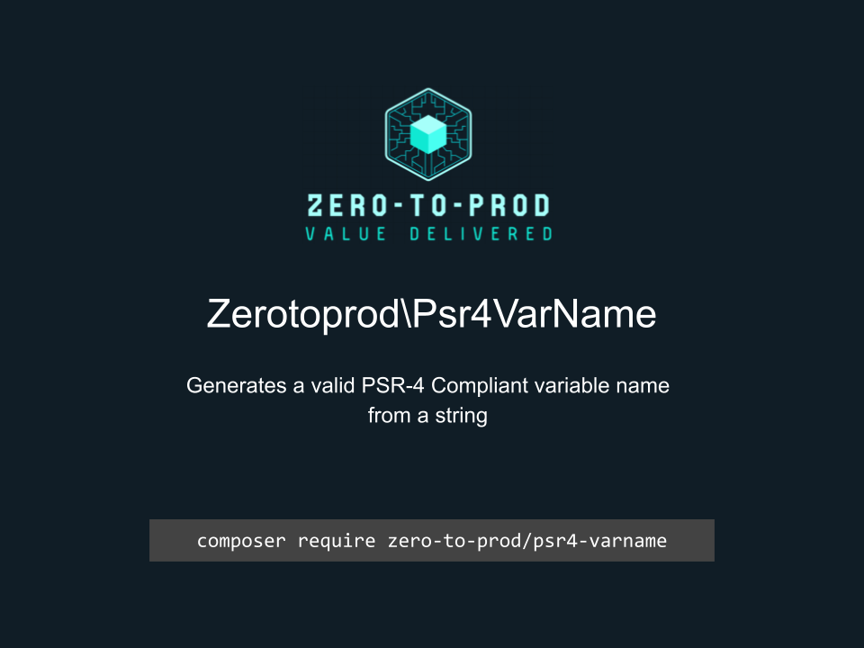

# Zerotoprod\Psr4VarName



[](https://github.com/zero-to-prod/psr4-classname)
[](https://github.com/zero-to-prod/psr4-classname/actions)
[](https://packagist.org/packages/zero-to-prod/psr4-classname/stats)
[](https://packagist.org/packages/zero-to-prod/psr4-classname/stats)
[](https://packagist.org/packages/zero-to-prod/psr4-classname)
[](https://github.com/zero-to-prod/psr4-classname/blob/main/LICENSE.md)

- [Introduction](#introduction)
- [Requirements](#requirements)
- [Installation](#installation)
- [Usage](#usage)
- [Testing](#testing)
- [Contributing](#contributing)

## Introduction

Generates a valid PSR-4 Compliant variable name from a string.

## Requirements

- PHP 7.1 or higher.

## Installation

Install `Zerotoprod\Psr4VarName` via [Composer](https://getcomposer.org/):

```shell
composer require zero-to-prod/psr4-varname
```

This will add the package to your project’s dependencies and create an autoloader entry for it.

## Usage

```php
use Zerotoprod\Psr4Classname\VarName;

VarName::generate('weird%characters*in^name'); // 'weird_characters_in_name';
```

## Testing

```shell
./vendor/bin/phpunit
```

## Contributing

Contributions, issues, and feature requests are welcome!
Feel free to check the [issues](https://github.com/zero-to-prod/omdb/issues) page if you want to contribute.

1. Fork the repository.
2. Create a new branch (`git checkout -b feature-branch`).
3. Commit changes (`git commit -m 'Add some feature'`).
4. Push to the branch (`git push origin feature-branch`).
5. Create a new Pull Request.